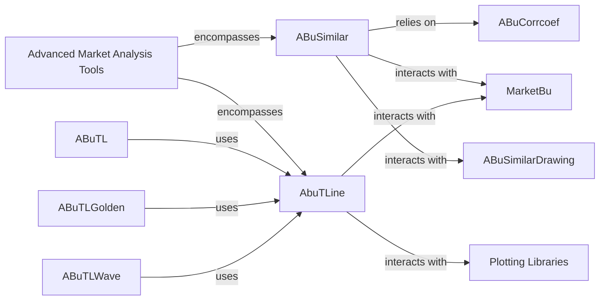

## Component Details

This analysis provides a refined overview of the `Advanced Market Analysis Tools` component and its sub-components, detailing their functionalities and interdependencies based on source code analysis.

### Advanced Market Analysis Tools

This component offers specialized analytical tools beyond standard technical indicators, such as similarity analysis for pattern recognition and trend line analysis for identifying support, resistance, and market trends. These tools provide deeper insights into market behavior.

**Related Classes/Methods**: _None_

### ABuSimilar

This component is responsible for finding similarities between different market data series, primarily for identifying correlated assets or patterns. It involves calculating correlation coefficients and handling market data changes to provide insights into market relationships. It uses local data by default for similarity calculations.

**Related Classes/Methods**:

- <a href="https://github.com/bbfamily/abu/blob/master/abupy/SimilarBu/ABuSimilar.py#L89-L121" target="_blank" rel="noopener noreferrer">`abupy.SimilarBu.ABuSimilar:_find_similar` (89:121)</a>

- <a href="https://github.com/bbfamily/abu/blob/master/abupy/SimilarBu/ABuSimilar.py#L124-L138" target="_blank" rel="noopener noreferrer">`abupy.SimilarBu.ABuSimilar:find_similar_with_se` (124:138)</a>

- <a href="https://github.com/bbfamily/abu/blob/master/abupy/SimilarBu/ABuSimilar.py#L141-L154" target="_blank" rel="noopener noreferrer">`abupy.SimilarBu.ABuSimilar:find_similar_with_folds` (141:154)</a>

- <a href="https://github.com/bbfamily/abu/blob/master/abupy/SimilarBu/ABuSimilar.py#L157-L170" target="_blank" rel="noopener noreferrer">`abupy.SimilarBu.ABuSimilar:find_similar_with_cnt` (157:170)</a>

- <a href="https://github.com/bbfamily/abu/blob/master/abupy/SimilarBu/ABuSimilar.py#L174-L203" target="_blank" rel="noopener noreferrer">`abupy.SimilarBu.ABuSimilar:_make_symbols_cg_df` (174:203)</a>

### AbuTLine

This component provides a comprehensive suite of tools for visualizing and analyzing technical indicators and trend lines on market data. It focuses on drawing various types of lines and channels, identifying support/resistance levels, and displaying key price points to aid in technical analysis.

**Related Classes/Methods**:

- <a href="https://github.com/bbfamily/abu/blob/master/abupy/TLineBu/ABuTLine.py#L0-L0" target="_blank" rel="noopener noreferrer">`abupy.TLineBu.ABuTLine:show_kl_pd` (0:0)</a>

- <a href="https://github.com/bbfamily/abu/blob/master/abupy/TLineBu/ABuTLine.py#L0-L0" target="_blank" rel="noopener noreferrer">`abupy.TLineBu.ABuTLine:show_support_resistance_select_k` (0:0)</a>

- <a href="https://github.com/bbfamily/abu/blob/master/abupy/TLineBu/ABuTLine.py#L0-L0" target="_blank" rel="noopener noreferrer">`abupy.TLineBu.ABuTLine:show_regress_trend_channel` (0:0)</a>

### ABuCorrcoef

This component is dedicated to performing various correlation calculations, which are fundamental to the `ABuSimilar` component for determining the similarity between market data series.

**Related Classes/Methods**:

- <a href="https://github.com/bbfamily/abu/blob/master/abupy/SimilarBu/ABuCorrcoef.py#L0-L0" target="_blank" rel="noopener noreferrer">`abupy.SimilarBu.ABuCorrcoef:multi_corr_df` (0:0)</a>

### ABuSimilarDrawing

This component is responsible for the visualization aspects of the similarity analysis results, providing graphical representations to aid in understanding market relationships.

**Related Classes/Methods**:

- <a href="https://github.com/bbfamily/abu/blob/master/abupy/SimilarBu/ABuSimilarDrawing.py#L0-L0" target="_blank" rel="noopener noreferrer">`abupy.SimilarBu.ABuSimilarDrawing` (0:0)</a>

### MarketBu

This component is a foundational module responsible for obtaining and managing market data, which is crucial for both similarity and trend line analysis. It provides the raw data necessary for these advanced tools.

**Related Classes/Methods**:

- <a href="https://github.com/bbfamily/abu/blob/master/abupy/MarketBu/ABuMarket.py#L0-L0" target="_blank" rel="noopener noreferrer">`abupy.MarketBu.ABuMarket` (0:0)</a>

- <a href="https://github.com/bbfamily/abu/blob/master/abupy/MarketBu/ABuSymbolPd.py#L0-L0" target="_blank" rel="noopener noreferrer">`abupy.MarketBu.ABuSymbolPd` (0:0)</a>

### ABuTLGolden

This component specializes in applying the Golden Ratio to trend line analysis, offering specific tools for identifying Fibonacci-related support and resistance levels.

**Related Classes/Methods**:

- <a href="https://github.com/bbfamily/abu/blob/master/abupy/TLineBu/ABuTLGolden.py#L0-L0" target="_blank" rel="noopener noreferrer">`abupy.TLineBu.ABuTLGolden` (0:0)</a>

### ABuTLWave

This component focuses on wave analysis within trend lines, likely implementing concepts like Elliott Wave Theory to predict market movements.

**Related Classes/Methods**:

- <a href="https://github.com/bbfamily/abu/blob/master/abupy/TLineBu/ABuTLWave.py#L0-L0" target="_blank" rel="noopener noreferrer">`abupy.TLineBu.ABuTLWave` (0:0)</a>

### ABuTL

This component appears to be a general utility or entry point for various trend line functionalities, potentially orchestrating calls to other specialized trend line modules.

**Related Classes/Methods**:

- <a href="https://github.com/bbfamily/abu/blob/master/abupy/TLineBu/ABuTL.py#L0-L0" target="_blank" rel="noopener noreferrer">`abupy.TLineBu.ABuTL` (0:0)</a>

### Plotting Libraries

These are external libraries (e.g., Matplotlib, Pandas plotting capabilities) used by `AbuTLine` and `ABuSimilarDrawing` for rendering visualizations of market data and analytical results.

**Related Classes/Methods**: _None_

### [FAQ](https://github.com/CodeBoarding/GeneratedOnBoardings/tree/main?tab=readme-ov-file#faq)