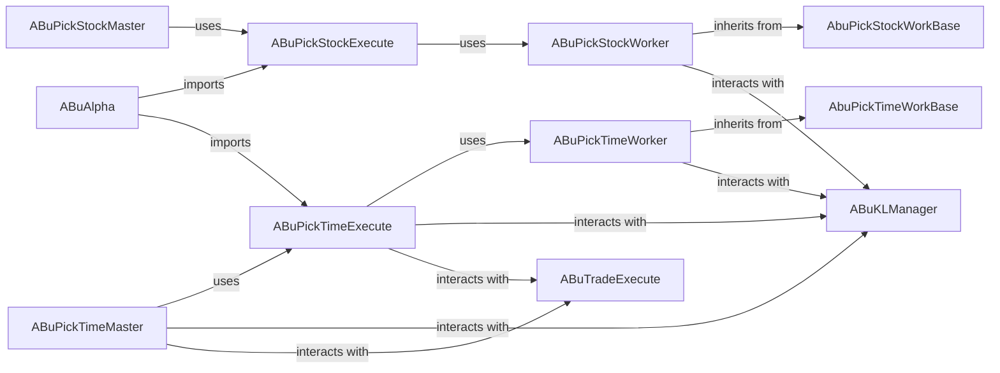

## Component Details

The previous analysis contained inaccuracies regarding the base class `ABuPickBase` and the inheritance relationships of `ABuPickStockWorker` and `ABuPickTimeWorker`. The feedback indicated that `ABuPickBase` was not found, and the workers inherit from more specific base classes. Upon re-evaluation using the available tools: 1. `ABuPickBase` Verification: The file `abupy/AlphaBu/ABuPickBase.py` does not contain a class named `ABuPickBase`. Instead, it defines two abstract base classes: `AbuPickTimeWorkBase` and `AbuPickStockWorkBase`. This clarifies why the source code for `ABuPickBase` could not be retrieved. 2. Inheritance Correction: As confirmed by `getClassHierarchy`, `ABuPickStockWorker` inherits from `abupy.AlphaBu.ABuPickBase.AbuPickStockWorkBase`, and `ABuPickTimeWorker` inherits from `abupy.AlphaBu.ABuPickBase.AbuPickTimeWorkBase`. The analysis will be updated to reflect these correct inheritance relationships. 3. Interaction Verification: The "uses" and "interacts with" relationships will be re-validated by inspecting the source code of the relevant components.

### AbuPickStockWorkBase

This abstract base class defines the foundational structure and common methods (`fit`, `init_stock_pickers`) that concrete stock picking implementations must adhere to. It serves as the interface for stock selection workers.

**Related Classes/Methods**:

- <a href="https://github.com/bbfamily/abu/blob/master/abupy/AlphaBu/ABuPickBase.py#L45-L62" target="_blank" rel="noopener noreferrer">`abupy.AlphaBu.ABuPickBase:AbuPickStockWorkBase` (45:62)</a>

### AbuPickTimeWorkBase

This abstract base class defines the foundational structure and common methods (`fit`, `init_buy_factors`, `init_sell_factors`) that concrete time-based picking implementations must adhere to. It serves as the interface for time-based selection workers.

**Related Classes/Methods**:

- <a href="https://github.com/bbfamily/abu/blob/master/abupy/AlphaBu/ABuPickBase.py#L18-L42" target="_blank" rel="noopener noreferrer">`abupy.AlphaBu.ABuPickBase:AbuPickTimeWorkBase` (18:42)</a>

### ABuPickStockWorker

This component implements the core logic for selecting individual stocks. It initializes and applies various stock picking factors (both "first-choice" and "batch" types) to filter a list of potential trading symbols. It iterates through symbols and factors, deciding which stocks pass the selection criteria.

**Related Classes/Methods**:

- <a href="https://github.com/bbfamily/abu/blob/master/abupy/AlphaBu/ABuPickStockWorker.py#L1-L1" target="_blank" rel="noopener noreferrer">`abupy.AlphaBu.ABuPickStockWorker:ABuPickStockWorker` (1:1)</a>

### ABuPickStockExecute

This component acts as an execution wrapper for the stock picking process. It coordinates the application of stock picking factors by instantiating and leveraging `ABuPickStockWorker` to process a given set of symbols. It also provides a threaded execution option for smaller-scale parallelism.

**Related Classes/Methods**:

- <a href="https://github.com/bbfamily/abu/blob/master/abupy/AlphaBu/ABuPickStockExecute.py#L1-L1" target="_blank" rel="noopener noreferrer">`abupy.AlphaBu.ABuPickStockExecute:ABuPickStockExecute` (1:1)</a>

### ABuPickStockMaster

This component orchestrates the overall stock picking process, especially when parallel execution across multiple processes is required. It manages the distribution of stock picking tasks to `ABuPickStockExecute` instances, aggregates results, and handles environmental configurations for multiprocessing.

**Related Classes/Methods**:

- <a href="https://github.com/bbfamily/abu/blob/master/abupy/AlphaBu/ABuPickStockMaster.py#L1-L1" target="_blank" rel="noopener noreferrer">`abupy.AlphaBu.ABuPickStockMaster:ABuPickStockMaster` (1:1)</a>

### ABuPickTimeWorker

This component implements the core logic for selecting specific time periods or bars within a trading strategy. It applies time-based buy and sell factors by iterating through the financial time series data (KL-period data) and generating trading orders based on factor signals. It supports daily, weekly, and monthly tasks.

**Related Classes/Methods**:

- <a href="https://github.com/bbfamily/abu/blob/master/abupy/AlphaBu/ABuPickTimeWorker.py#L1-L1" target="_blank" rel="noopener noreferrer">`abupy.AlphaBu.ABuPickTimeWorker:ABuPickTimeWorker` (1:1)</a>

### ABuPickTimeExecute

This component manages the execution flow of time-based trading strategies for multiple symbols. It coordinates the application of buy and sell factors by relying on `ABuPickTimeWorker` for the underlying time-based selection logic. It also handles error codes, result aggregation (orders and actions), and capital application.

**Related Classes/Methods**:

- <a href="https://github.com/bbfamily/abu/blob/master/abupy/AlphaBu/ABuPickTimeExecute.py#L1-L1" target="_blank" rel="noopener noreferrer">`abupy.AlphaBu.ABuPickTimeExecute:ABuPickTimeExecute` (1:1)</a>

### ABuPickTimeMaster

This component orchestrates the time-based strategy execution, particularly for parallel processing of multiple symbols. It distributes symbols to `ABuPickTimeExecute` instances across multiple processes, manages the batch fetching of KL-period data, and merges the results from parallel executions.

**Related Classes/Methods**:

- <a href="https://github.com/bbfamily/abu/blob/master/abupy/AlphaBu/ABuPickTimeMaster.py#L1-L1" target="_blank" rel="noopener noreferrer">`abupy.AlphaBu.ABuPickTimeMaster:ABuPickTimeMaster` (1:1)</a>

### ABuAlpha

This module serves as a high-level entry point or aggregator for the Alpha Strategy component. It imports and exposes key functions from `ABuPickStockExecute` and `ABuPickTimeExecute`, providing a unified interface for initiating and running alpha strategies that involve both stock picking and time-based execution.

**Related Classes/Methods**:

- <a href="https://github.com/bbfamily/abu/blob/master/abupy/AlphaBu/ABuAlpha.py#L1-L1" target="_blank" rel="noopener noreferrer">`abupy.AlphaBu.ABuAlpha:ABuAlpha` (1:1)</a>

### ABuKLManager

Manages financial time series data (KL-period data).

**Related Classes/Methods**:

- `abupy.AlphaBu.ABuKLManager` (1:1)

### ABuTradeExecute

Handles the execution of trading actions and capital management.

**Related Classes/Methods**:

- `abupy.AlphaBu.ABuTradeExecute` (1:1)

### [FAQ](https://github.com/CodeBoarding/GeneratedOnBoardings/tree/main?tab=readme-ov-file#faq)