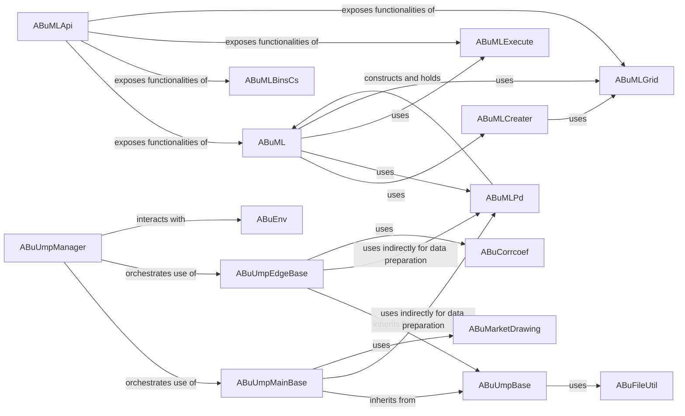

## Component Details

The Machine Learning & Predictive Analytics component in abupy is primarily composed of two sub-packages: MLBu (Machine Learning Business Unit) and UmpBu (Unified Machine Learning Platform Business Unit). This analysis details the central components, their responsibilities, and interactions within this subsystem.

### ABuML

This is the core class for general machine learning tasks. It acts as a high-level wrapper around various scikit-learn estimators, providing methods for cross-validation, feature selection, training, prediction, and visualization. It orchestrates the ML workflow by integrating with other MLBu components.

**Related Classes/Methods**: _None_

### ABuMLCreater

Responsible for instantiating and configuring various machine learning estimators (e.g., linear regression, SVC, bagging, boosting, random forest, decision trees, KNN, PCA, KMeans, GMM). It provides methods to create pre-configured or optimized estimators based on input parameters.

**Related Classes/Methods**: _None_

### ABuMLPd

Focuses on preparing data using pandas DataFrames for machine learning tasks. It defines an abstract make_xy method that subclasses must implement to create feature (X) and target (y) datasets. It also handles data transformations and integrates with ABuML to construct the ML model.

**Related Classes/Methods**: _None_

### ABuMLGrid

Provides functionalities for hyperparameter grid search using GridSearchCV from scikit-learn. It allows for optimization of ML model parameters by searching through defined ranges for parameters like n_estimators, max_depth, n_neighbors, and n_components. It also includes visualization of search results.

**Related Classes/Methods**: _None_

### ABuMLExecute

Contains utility functions for visualizing and executing machine learning results. This includes plotting decision boundaries, confusion matrices, ROC curves, learning curves, and executing cross-validation.

**Related Classes/Methods**: _None_

### ABuMLApi

Acts as a high-level API or facade for the MLBu sub-component. It provides a unified interface to various ML functionalities by importing and exposing classes and functions from ABuML, ABuMLBinsCs, ABuMLExecute, and ABuMLGrid. This suggests it's a primary entry point for users to interact with the general machine learning capabilities.

**Related Classes/Methods**: _None_

### ABuUmpManager

This component acts as the orchestrator for various unsupervised models within the Unified Machine Learning Platform (UMP). It manages different "hit count" methods (e.g., ump_main_deg_hit_cnt, ump_main_jump_hit_cnt), suggesting it applies different unsupervised models or strategies to analyze data based on specific criteria. It also supports extending and building in-built "ump blocks."

**Related Classes/Methods**: _None_

### ABuUmpBase

This is the foundational base class for all UMP models, providing common functionalities or interfaces for both "main" and "edge" unsupervised models. It includes a CachedUmpManager for caching trained UMP models. It also defines decorators (ump_main_make_xy, ump_edge_make_xy) for data preparation specific to main and edge UMP models.

**Related Classes/Methods**: _None_

### ABuUmpMainBase

This is a base class for "main" unsupervised models, likely representing more complex or global unsupervised tasks. It includes methods for fitting, dumping, predicting, and choosing components, with specific functions like _do_gmm_cluster and _fit_cprs, suggesting clustering and component analysis. It also handles the visualization and saving of trade snapshots for analysis.

**Related Classes/Methods**: _None_

### ABuUmpEdgeBase

This is a base class for "edge" unsupervised models. It handles the fitting and dumping of classifiers, suggesting it deals with models that might operate on specific "edges" or segments of data, or perhaps simpler, more localized unsupervised tasks. It also defines methods for feature collection and prediction based on similarity and voting.

**Related Classes/Methods**: _None_

### [FAQ](https://github.com/CodeBoarding/GeneratedOnBoardings/tree/main?tab=readme-ov-file#faq)