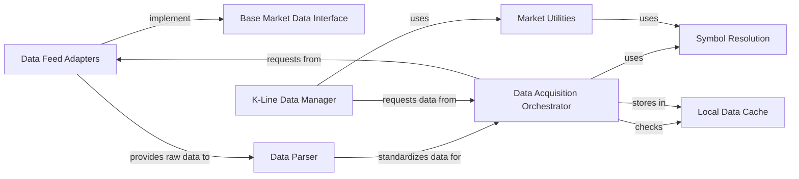

## Component Details

Component Overview: Market Data Management

This component is the backbone for all data-driven operations, responsible for the acquisition, standardization, storage, and efficient retrieval of historical market data (K-line data) for various financial instruments. It handles symbol resolution across different markets and manages local data caching for performance, acting as the primary data source for the entire system.

### Symbol Resolution

This component, primarily embodied by the `Symbol` class and `code_to_symbol` function, is responsible for standardizing and resolving financial instrument codes (e.g., "usTSLA", "sz300104") into a unified `Symbol` object. This object encapsulates market type (e.g., US, CN, HK) and sub-market (exchange) information, ensuring consistent identification across the system.

**Related Classes/Methods**:

- <a href="https://github.com/bbfamily/abu/blob/master/abupy/MarketBu/ABuSymbol.py#L259-L370" target="_blank" rel="noopener noreferrer">`abupy.MarketBu.ABuSymbol.Symbol` (259:370)</a>

- <a href="https://github.com/bbfamily/abu/blob/master/abupy/MarketBu/ABuSymbol.py#L19-L114" target="_blank" rel="noopener noreferrer">`abupy.MarketBu.ABuSymbol.code_to_symbol` (19:114)</a>

### Base Market Data Interface

Defined by abstract base classes like `BaseMarket`, `StockBaseMarket`, `FuturesBaseMarket`, and `TCBaseMarket`, this component establishes the common contract and utility methods for all specific data feed implementations. It ensures that different data sources adhere to a consistent interface for fetching K-line and minute data, and includes methods for data cleaning and slicing.

**Related Classes/Methods**:

- <a href="https://github.com/bbfamily/abu/blob/master/abupy/MarketBu/ABuDataBase.py#L58-L141" target="_blank" rel="noopener noreferrer">`abupy.MarketBu.ABuDataBase.BaseMarket` (58:141)</a>

- <a href="https://github.com/bbfamily/abu/blob/master/abupy/MarketBu/ABuDataBase.py#L144-L160" target="_blank" rel="noopener noreferrer">`abupy.MarketBu.ABuDataBase.StockBaseMarket` (144:160)</a>

- <a href="https://github.com/bbfamily/abu/blob/master/abupy/MarketBu/ABuDataBase.py#L163-L176" target="_blank" rel="noopener noreferrer">`abupy.MarketBu.ABuDataBase.FuturesBaseMarket` (163:176)</a>

- <a href="https://github.com/bbfamily/abu/blob/master/abupy/MarketBu/ABuDataBase.py#L179-L195" target="_blank" rel="noopener noreferrer">`abupy.MarketBu.ABuDataBase.TCBaseMarket` (179:195)</a>

### Data Feed Adapters

This component comprises concrete implementations of data source APIs (e.g., `BDApi`, `TXApi`, `NTApi`) that directly interact with external market data providers. They are responsible for making network requests, handling API specifics, and retrieving raw market data in its original format.

**Related Classes/Methods**:

- <a href="https://github.com/bbfamily/abu/blob/master/abupy/MarketBu/ABuDataFeed.py#L84-L150" target="_blank" rel="noopener noreferrer">`abupy.MarketBu.ABuDataFeed.BDApi` (84:150)</a>

- <a href="https://github.com/bbfamily/abu/blob/master/abupy/MarketBu/ABuDataFeed.py#L153-L251" target="_blank" rel="noopener noreferrer">`abupy.MarketBu.ABuDataFeed.TXApi` (153:251)</a>

- <a href="https://github.com/bbfamily/abu/blob/master/abupy/MarketBu/ABuDataFeed.py#L254-L312" target="_blank" rel="noopener noreferrer">`abupy.MarketBu.ABuDataFeed.NTApi` (254:312)</a>

### Data Parser

Utilizing the `AbuDataParseWrap` decorator and specific parser classes (e.g., `TXParser`, `BDParser`), this component transforms the raw data received from `Data Feed Adapters` into a standardized Pandas DataFrame format. It ensures that all K-line data (open, close, high, low, volume, date) is consistently structured and includes derived metrics like `pre_close` and `p_change`.

**Related Classes/Methods**:

- <a href="https://github.com/bbfamily/abu/blob/master/abupy/MarketBu/ABuDataParser.py#L34-L117" target="_blank" rel="noopener noreferrer">`abupy.MarketBu.ABuDataParser.AbuDataParseWrap` (34:117)</a>

- <a href="https://github.com/bbfamily/abu/blob/master/abupy/MarketBu/ABuDataParser.py#L121-L154" target="_blank" rel="noopener noreferrer">`abupy.MarketBu.ABuDataParser.TXParser` (121:154)</a>

- <a href="https://github.com/bbfamily/abu/blob/master/abupy/MarketBu/ABuDataParser.py#L295-L352" target="_blank" rel="noopener noreferrer">`abupy.MarketBu.ABuDataParser.BDParser` (295:352)</a>

### Local Data Cache

This component manages the local storage and retrieval of historical K-line data, primarily supporting HDF5 and CSV formats. It provides mechanisms to load, dump, and remove cached data, significantly improving performance by minimizing redundant network requests and providing quick access to frequently used data.

**Related Classes/Methods**: _None_

### Data Acquisition Orchestrator

The central control point for market data acquisition, implemented through the `kline_pd` function. It orchestrates the data fetching process: first attempting to retrieve data from the `Local Data Cache`, and if not available or forced, then invoking the appropriate `Data Feed Adapters` to fetch data from the network. It also handles symbol conversion and data filtering based on requested timeframes.

**Related Classes/Methods**:

- <a href="https://github.com/bbfamily/abu/blob/master/abupy/MarketBu/ABuDataSource.py#L99-L201" target="_blank" rel="noopener noreferrer">`abupy.MarketBu.ABuDataSource.kline_pd` (99:201)</a>

### K-Line Data Manager

This component, represented by `AbuKLManager`, is responsible for managing and providing financial time series (K-line) data for various analytical and trading strategies. It handles the batch retrieval of K-line data, often leveraging parallel processing, and organizes it for efficient access by "pick stock" and "pick time" modules.

**Related Classes/Methods**:

- <a href="https://github.com/bbfamily/abu/blob/master/abupy/TradeBu/ABuKLManager.py#L66-L260" target="_blank" rel="noopener noreferrer">`abupy.TradeBu.ABuKLManager.AbuKLManager` (66:260)</a>

### Market Utilities

This component provides a collection of utility functions and a `MarketMixin` for common market-related operations. These include splitting symbol lists for parallel processing, randomly selecting symbols for backtesting or simulation, and retrieving comprehensive lists of symbols for different markets (e.g., US, CN, HK stocks, futures, cryptocurrencies).

**Related Classes/Methods**:

- <a href="https://github.com/bbfamily/abu/blob/master/abupy/MarketBu/ABuMarket.py#L46-L70" target="_blank" rel="noopener noreferrer">`abupy.MarketBu.ABuMarket.MarketMixin` (46:70)</a>

### [FAQ](https://github.com/CodeBoarding/GeneratedOnBoardings/tree/main?tab=readme-ov-file#faq)