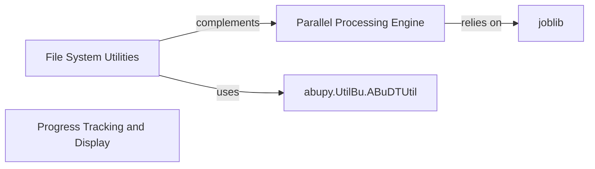

## Component Details

One paragraph explaining the functionality which is represented by this graph. What the main flow is and what is its purpose.

### File System Utilities

This component offers a comprehensive set of functions for common file system operations. It handles tasks such as creating and ensuring directories, copying and deleting files/directories, and serializing/deserializing Python objects and dataframes using various formats like pickle, HDF5, and CSV. It also provides context managers for efficient batch HDF5 operations, which are vital for managing large datasets.

**Related Classes/Methods**:

- <a href="https://github.com/bbfamily/abu/blob/master/abupy/UtilBu/ABuFileUtil.py#L1-L1000" target="_blank" rel="noopener noreferrer">`abupy.UtilBu.ABuFileUtil` (1:1000)</a>

- <a href="https://github.com/bbfamily/abu/blob/master/abupy/UtilBu/ABuFileUtil.py#L31-L42" target="_blank" rel="noopener noreferrer">`abupy.UtilBu.ABuFileUtil.ensure_dir` (31:42)</a>

- <a href="https://github.com/bbfamily/abu/blob/master/abupy/UtilBu/ABuFileUtil.py#L97-L118" target="_blank" rel="noopener noreferrer">`abupy.UtilBu.ABuFileUtil.load_pickle` (97:118)</a>

- <a href="https://github.com/bbfamily/abu/blob/master/abupy/UtilBu/ABuFileUtil.py#L121-L146" target="_blank" rel="noopener noreferrer">`abupy.UtilBu.ABuFileUtil.dump_pickle` (121:146)</a>

- <a href="https://github.com/bbfamily/abu/blob/master/abupy/UtilBu/ABuFileUtil.py#L174-L207" target="_blank" rel="noopener noreferrer">`abupy.UtilBu.ABuFileUtil.batch_h5s` (174:207)</a>

### Progress Tracking and Display

This component is dedicated to managing and displaying progress for both single and multi-process operations. It intelligently adapts to the execution environment, providing UI-based progress bars for interactive notebook environments (leveraging IPython widgets) and console clearing for command-line execution. It also facilitates inter-process communication to enable child processes to send progress updates to the main process.

**Related Classes/Methods**:

- <a href="https://github.com/bbfamily/abu/blob/master/abupy/UtilBu/ABuProgress.py#L1-L1000" target="_blank" rel="noopener noreferrer">`abupy.UtilBu.ABuProgress` (1:1000)</a>

### Parallel Processing Engine

This component provides a high-level, user-friendly interface for parallelizing function calls, abstracting away the complexities of multiprocessing or multithreading. It supports various execution backends and includes features such as progress meters, robust error handling, and memory mapping for efficient handling of large arrays, making it suitable for computationally intensive tasks. It leverages `joblib` for its core parallel execution capabilities.

**Related Classes/Methods**:

- <a href="https://github.com/bbfamily/abu/blob/master/abupy/ExtBu/joblib/parallel.py#L1-L1000" target="_blank" rel="noopener noreferrer">`abupy.ExtBu.joblib.parallel.Parallel` (1:1000)</a>

### joblib

An external library used for parallel computing.

**Related Classes/Methods**: _None_

### abupy.UtilBu.ABuDTUtil

A utility component for date and time-related operations.

**Related Classes/Methods**: _None_

### [FAQ](https://github.com/CodeBoarding/GeneratedOnBoardings/tree/main?tab=readme-ov-file#faq)