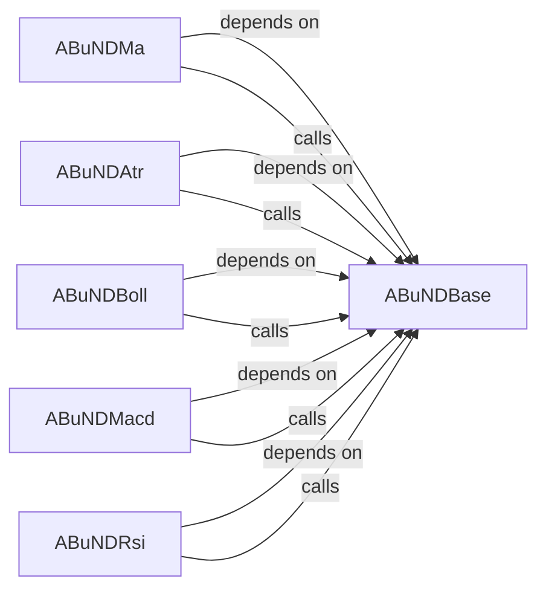

## Component Details

This component provides a comprehensive library of commonly used technical analysis indicators, such as Moving Averages, ATR, Bollinger Bands, MACD, and RSI. It is designed to calculate these indicators efficiently from raw market data and make them available for integration into trading strategies and other analytical components. A key feature is its ability to plot these indicators directly onto charts, often with overlaid trading signals.

### ABuNDBase

This is the foundational module for the entire technical analysis indicator subsystem. It provides common utilities, including a standardized mechanism (`plot_from_order`) for integrating trading order signals directly onto technical indicator charts. It also defines the `ECalcType` enum and `g_calc_type` global variable to manage whether indicator calculations should use `talib` (if available) or a pure `pandas` implementation, ensuring consistency across different indicators.

**Related Classes/Methods**:

- <a href="https://github.com/bbfamily/abu/blob/master/abupy/IndicatorBu/ABuNDBase.py#L42-L104" target="_blank" rel="noopener noreferrer">`ABuNDBase:plot_from_order` (42:104)</a>

- <a href="https://github.com/bbfamily/abu/blob/master/abupy/IndicatorBu/ABuNDBase.py#L20-L27" target="_blank" rel="noopener noreferrer">`ABuNDBase:ECalcType` (20:27)</a>

- <a href="https://github.com/bbfamily/abu/blob/master/abupy/IndicatorBu/ABuNDBase.py#L1-L1" target="_blank" rel="noopener noreferrer">`ABuNDBase:g_calc_type` (1:1)</a>

### ABuNDMa

This component is responsible for calculating and plotting various types of Moving Averages (MA), such as Simple Moving Average (SMA) and Exponential Moving Average (EMA). It offers both `talib` and `pandas`-based calculation methods and integrates seamlessly with `ABuNDBase` for plotting trading signals and the MA lines themselves.

**Related Classes/Methods**: _None_

### ABuNDAtr

This component specializes in the calculation and visualization of the Average True Range (ATR) indicator, a key measure of market volatility. It provides methods for computing ATR using either `talib` or a custom `pandas` implementation, and leverages the `plot_from_order` utility from `ABuNDBase` for plotting ATR alongside trading signals.

**Related Classes/Methods**: _None_

### ABuNDBoll

This component handles the computation and graphical representation of Bollinger Bands, a popular volatility channel indicator. It includes algorithms for calculating the middle, upper, and lower bands using `talib` or `pandas`, and integrates with `ABuNDBase` for chart plotting, allowing for visualization of price action relative to the bands.

**Related Classes/Methods**: _None_

### ABuNDMacd

This component manages the calculation and visualization of the Moving Average Convergence Divergence (MACD) indicator, a momentum oscillator. It provides methods for computing the MACD line, signal line, and MACD histogram, with support for both `talib` and `pandas` implementations, and uses `ABuNDBase` for plotting trading signals on the MACD chart.

**Related Classes/Methods**: _None_

### ABuNDRsi

This component is dedicated to the computation and graphical representation of the Relative Strength Index (RSI), a momentum oscillator used to identify overbought or oversold conditions. It supports `talib` and `pandas`-based calculations and integrates with `ABuNDBase` for plotting RSI values and associated trading points.

**Related Classes/Methods**: _None_

### [FAQ](https://github.com/CodeBoarding/GeneratedOnBoardings/tree/main?tab=readme-ov-file#faq)