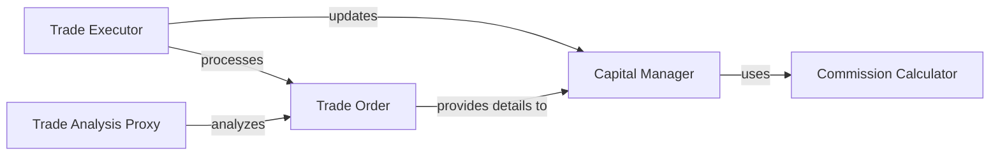

## Component Details

This component simulates the financial aspects of trading within the backtesting framework. It meticulously manages the initial capital, tracks real-time cash balances and stock holdings, processes buy and sell orders, and accurately calculates transaction costs, including commissions. Its core purpose is to ensure that all simulated trades adhere strictly to predefined capital constraints and that the portfolio's state is precisely reflected throughout the backtesting process.

### Capital Manager

This component acts as the financial ledger of the trading system. It is responsible for initializing and managing the total capital, tracking the cash balance, and monitoring stock holdings over time. It updates the portfolio's state based on trade executions and ensures that all transactions respect capital constraints.

**Related Classes/Methods**:

- <a href="https://github.com/bbfamily/abu/blob/master/abupy/TradeBu/ABuCapital.py#L1-L1" target="_blank" rel="noopener noreferrer">`ABuCapital` (1:1)</a>

### Commission Calculator

This component is dedicated to calculating and recording all transaction fees, such as commissions and taxes, based on the specific market type (e.g., US stocks, A-shares, futures) and any user-defined fee structures.

**Related Classes/Methods**:

- <a href="https://github.com/bbfamily/abu/blob/master/abupy/TradeBu/ABuCommission.py#L1-L1" target="_blank" rel="noopener noreferrer">`ABuCommission` (1:1)</a>

### Trade Order

This component represents a single, atomic trading instruction. It encapsulates all the essential details of a buy or sell transaction, including the financial instrument (symbol), execution price, quantity, date, and the factors that led to its creation.

**Related Classes/Methods**:

- <a href="https://github.com/bbfamily/abu/blob/master/abupy/TradeBu/ABuOrder.py#L1-L1" target="_blank" rel="noopener noreferrer">`ABuOrder` (1:1)</a>

### Trade Executor

This component serves as the primary execution engine for trades. It processes individual trade orders, determines their feasibility based on available capital, and orchestrates the updates to the financial state managed by the `Capital Manager`. It transforms abstract orders into concrete financial events.

**Related Classes/Methods**:

- <a href="https://github.com/bbfamily/abu/blob/master/abupy/TradeBu/ABuTradeExecute.py#L1-L1" target="_blank" rel="noopener noreferrer">`ABuTradeExecute` (1:1)</a>

### Trade Analysis Proxy

This component provides a wrapper for collections of trade orders, enabling advanced analytical and debugging operations. It supports set-like comparisons (union, intersection, difference) between different sets of trading results, which is crucial for evaluating and refining trading strategies.

**Related Classes/Methods**:

- <a href="https://github.com/bbfamily/abu/blob/master/abupy/TradeBu/ABuTradeProxy.py#L1-L1" target="_blank" rel="noopener noreferrer">`ABuTradeProxy` (1:1)</a>

### [FAQ](https://github.com/CodeBoarding/GeneratedOnBoardings/tree/main?tab=readme-ov-file#faq)