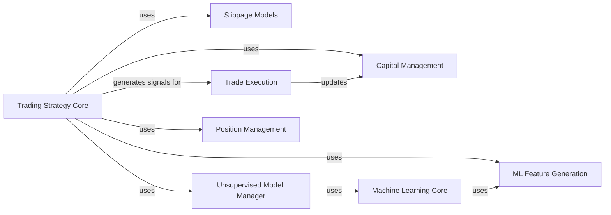

## Component Details

This section provides a detailed overview of the `Trading Strategy Core` component and its most fundamental interactions within the system. The analysis focuses on the structure, flow, and purpose of this core component, along with its direct dependencies and relationships with other key parts of the system.

### Trading Strategy Core

This component defines the abstract base for all buy and sell-side trading strategies. It provides the fundamental framework for implementing specific entry and exit conditions, serving as the foundation for concrete trading strategies. It integrates with capital management, slippage models, and machine learning decision-making components to form a complete trading logic.

**Related Classes/Methods**:

- <a href="https://github.com/bbfamily/abu/blob/master/abupy/FactorBuyBu/ABuFactorBuyBase.py#L0-L0" target="_blank" rel="noopener noreferrer">`ABuFactorBuyBase` (0:0)</a>

- <a href="https://github.com/bbfamily/abu/blob/master/abupy/FactorSellBu/ABuFactorSellBase.py#L0-L0" target="_blank" rel="noopener noreferrer">`ABuFactorSellBase` (0:0)</a>

### Capital Management

This component is responsible for managing the financial capital within the trading system. It handles initial capital allocation, position sizing, and tracks the overall profit and loss of trading activities.

**Related Classes/Methods**:

- <a href="https://github.com/bbfamily/abu/blob/master/abupy/TradeBu/ABuCapital.py#L0-L0" target="_blank" rel="noopener noreferrer">`ABuCapital` (0:0)</a>

### Slippage Models

This component provides models to simulate and account for slippage, which is the difference between the expected price of a trade and the price at which the trade is actually executed. It helps in realistic backtesting and performance evaluation.

**Related Classes/Methods**:

- <a href="https://github.com/bbfamily/abu/blob/master/abupy/SlippageBu/ABuSlippageBuyBase.py#L0-L0" target="_blank" rel="noopener noreferrer">`ABuSlippageBuyBase` (0:0)</a>

- <a href="https://github.com/bbfamily/abu/blob/master/abupy/SlippageBu/ABuSlippageSellBase.py#L0-L0" target="_blank" rel="noopener noreferrer">`ABuSlippageSellBase` (0:0)</a>

- <a href="https://github.com/bbfamily/abu/blob/master/abupy/SlippageBu/ABuSlippageBuyMean.py#L0-L0" target="_blank" rel="noopener noreferrer">`ABuSlippageBuyMean` (0:0)</a>

- <a href="https://github.com/bbfamily/abu/blob/master/abupy/SlippageBu/ABuSlippageSellMean.py#L0-L0" target="_blank" rel="noopener noreferrer">`ABuSlippageSellMean` (0:0)</a>

### Machine Learning Core

This is a central class for performing various machine learning tasks within the trading system. It acts as a high-level wrapper around different ML estimators, providing methods for cross-validation, feature selection, training, prediction, and visualization.

**Related Classes/Methods**:

- <a href="https://github.com/bbfamily/abu/blob/master/abupy/MLBu/ABuML.py#L0-L0" target="_blank" rel="noopener noreferrer">`ABuML` (0:0)</a>

### ML Feature Generation

This component is responsible for extracting and transforming raw financial data into structured features suitable for machine learning models. These features are crucial inputs for ML-driven decision-making within trading strategies.

**Related Classes/Methods**:

- <a href="https://github.com/bbfamily/abu/blob/master/abupy/TradeBu/ABuMLFeature.py#L0-L0" target="_blank" rel="noopener noreferrer">`ABuMLFeature` (0:0)</a>

### Unsupervised Model Manager

This component acts as an orchestrator for various unsupervised models, particularly in the context of trading decisions. It manages different "hit count" methods, applying various unsupervised strategies to analyze data based on specific criteria. Crucially, it integrates with the `Trading Strategy Core` by using `ABuFactorBuyBase` and `ABuFactorSellBase` for decision making, allowing ML-driven insights to influence trading actions.

**Related Classes/Methods**:

- <a href="https://github.com/bbfamily/abu/blob/master/abupy/UmpBu/ABuUmpManager.py#L0-L0" target="_blank" rel="noopener noreferrer">`ABuUmpManager` (0:0)</a>

### Trade Execution

This component handles the actual execution of trading orders, including placing buy/sell orders, managing transaction commissions, and interacting with market data to facilitate trades.

**Related Classes/Methods**:

- <a href="https://github.com/bbfamily/abu/blob/master/abupy/TradeBu/ABuOrder.py#L0-L0" target="_blank" rel="noopener noreferrer">`ABuOrder` (0:0)</a>

- <a href="https://github.com/bbfamily/abu/blob/master/abupy/TradeBu/ABuTradeExecute.py#L0-L0" target="_blank" rel="noopener noreferrer">`ABuTradeExecute` (0:0)</a>

- <a href="https://github.com/bbfamily/abu/blob/master/abupy/TradeBu/ABuCommission.py#L0-L0" target="_blank" rel="noopener noreferrer">`ABuCommission` (0:0)</a>

- <a href="https://github.com/bbfamily/abu/blob/master/abupy/TradeBu/ABuTradeProxy.py#L0-L0" target="_blank" rel="noopener noreferrer">`ABuTradeProxy` (0:0)</a>

### Position Management

This component is responsible for determining the size of trading positions and managing open positions according to predefined rules or dynamic calculations.

**Related Classes/Methods**:

- <a href="https://github.com/bbfamily/abu/blob/master/abupy/BetaBu/ABuAtrPosition.py#L0-L0" target="_blank" rel="noopener noreferrer">`ABuAtrPosition` (0:0)</a>

- <a href="https://github.com/bbfamily/abu/blob/master/abupy/BetaBu/ABuPositionBase.py#L0-L0" target="_blank" rel="noopener noreferrer">`ABuPositionBase` (0:0)</a>

### [FAQ](https://github.com/CodeBoarding/GeneratedOnBoardings/tree/main?tab=readme-ov-file#faq)