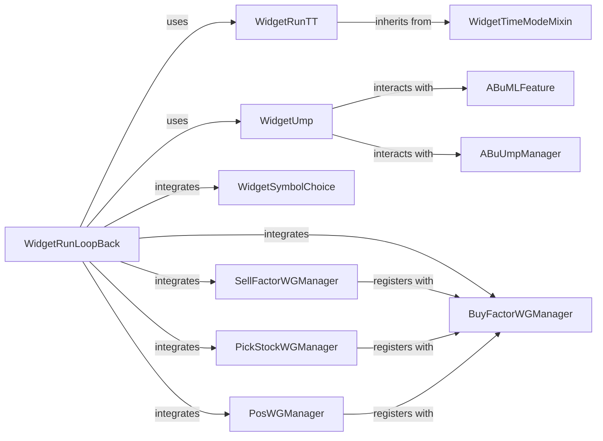

## Component Details

The `User Interface & Interaction` component of the `abu` framework provides the graphical interfaces for configuring, executing, and visualizing backtesting simulations and managing Unsupervised Machine Learning Prediction (UMP) models. This component is central to user engagement, allowing for detailed control over the framework's core functionalities.

### WidgetRunLoopBack

This is the primary UI component for initiating and managing backtesting simulations. It aggregates various sub-widgets for defining simulation parameters, trading strategies (buy/sell factors, stock picking, position management), and integrates UMP model application. It orchestrates the entire backtesting process and displays performance metrics.

**Related Classes/Methods**:

- `WidgetRunLoopBack` (0:0)

### WidgetUmp

This UI component is dedicated to the management of UMP models. It provides interfaces for collecting features, training new UMP models, applying trained models for prediction and trade interception during backtesting, and managing (loading/deleting) UMP-related data.

**Related Classes/Methods**:

- `WidgetUmp` (0:0)

### WidgetRunTT

A foundational UI component responsible for setting up core backtesting parameters. This includes defining the initial capital, specifying the simulation time range (either by years or by explicit start/end dates), and configuring how performance metrics are displayed. It leverages `WidgetTimeModeMixin` for time-related settings.

**Related Classes/Methods**:

- `WidgetRunTT` (0:0)

### WidgetTimeModeMixin

A reusable mixin class that provides the user interface and underlying logic for selecting and configuring time-based parameters for simulations. It allows users to choose between defining a simulation duration in years or specifying exact start and end dates, promoting consistency across various time-dependent widgets.

**Related Classes/Methods**:

- `WidgetTimeModeMixin` (0:0)

### WidgetSymbolChoice

This UI component allows users to select specific financial symbols (e.g., stocks) that will be included in the backtesting simulation. It provides the input mechanism for defining the universe of assets to be tested.

**Related Classes/Methods**:

- `WidgetSymbolChoice` (0:0)

### BuyFactorWGManager

A UI component designed for managing and configuring various "buy factors" or strategies that dictate when and how assets should be purchased during a backtest. It serves as a central point for defining buying rules.

**Related Classes/Methods**:

- `BuyFactorWGManager` (0:0)

### SellFactorWGManager

This UI component manages and configures "sell factors" or strategies, determining when and how assets should be sold. It can register with `BuyFactorWGManager` to receive updates or coordinate strategy changes.

**Related Classes/Methods**:

- `SellFactorWGManager` (0:0)

### PickStockWGManager

A UI component for defining and managing stock picking strategies. It allows users to set rules or algorithms for selecting stocks from a larger universe before applying buy/sell factors. It also registers with `BuyFactorWGManager`.

**Related Classes/Methods**:

- `PickStockWGManager` (0:0)

### PosWGManager

This UI component handles the configuration of position sizing and capital management strategies. It allows users to define how much capital is allocated per trade or asset, and how positions are managed. It registers with `BuyFactorWGManager`.

**Related Classes/Methods**:

- `PosWGManager` (0:0)

### ABuMLFeature

These are backend components that `WidgetUmp` interacts with to enable/disable the collection of trading features during backtesting and to manage the active UMP models. They are crucial for the UMP functionality to operate, providing the data and model management capabilities that the UI exposes.

**Related Classes/Methods**:

- <a href="https://github.com/bbfamily/abu/blob/master/abupy/TradeBu/ABuMLFeature.py#L0-L0" target="_blank" rel="noopener noreferrer">`ABuMLFeature` (0:0)</a>

### ABuUmpManager

These are backend components that `WidgetUmp` interacts with to enable/disable the collection of trading features during backtesting and to manage the active UMP models. They are crucial for the UMP functionality to operate, providing the data and model management capabilities that the UI exposes.

**Related Classes/Methods**:

- <a href="https://github.com/bbfamily/abu/blob/master/abupy/UmpBu/ABuUmpManager.py#L0-L0" target="_blank" rel="noopener noreferrer">`ABuUmpManager` (0:0)</a>

### [FAQ](https://github.com/CodeBoarding/GeneratedOnBoardings/tree/main?tab=readme-ov-file#faq)