```mermaid

graph LR

    Market_Data_Management["Market Data Management"]

    Trading_Strategy_Core["Trading Strategy Core"]

    Trading_Execution_Capital_Management["Trading Execution & Capital Management"]

    Machine_Learning_Predictive_Analytics["Machine Learning & Predictive Analytics"]

    Performance_Analysis_Optimization["Performance Analysis & Optimization"]

    Alpha_Strategy_Target_Selection["Alpha Strategy & Target Selection"]

    Technical_Analysis_Indicators["Technical Analysis Indicators"]

    Advanced_Market_Analysis_Tools["Advanced Market Analysis Tools"]

    System_Utilities_Infrastructure["System Utilities & Infrastructure"]

    User_Interface_Interaction["User Interface & Interaction"]

    Market_Data_Management -- "provides data to" --> Trading_Strategy_Core

    Market_Data_Management -- "provides data to" --> Technical_Analysis_Indicators

    Trading_Strategy_Core -- "receives data from" --> Market_Data_Management

    Trading_Strategy_Core -- "sends signals to" --> Trading_Execution_Capital_Management

    Trading_Execution_Capital_Management -- "receives orders from" --> Trading_Strategy_Core

    Trading_Execution_Capital_Management -- "sends results to" --> Performance_Analysis_Optimization

    Machine_Learning_Predictive_Analytics -- "provides decision blocking to" --> Trading_Strategy_Core

    Machine_Learning_Predictive_Analytics -- "utilizes" --> System_Utilities_Infrastructure

    Performance_Analysis_Optimization -- "receives data from" --> Trading_Execution_Capital_Management

    Performance_Analysis_Optimization -- "utilizes" --> System_Utilities_Infrastructure

    Alpha_Strategy_Target_Selection -- "receives data from" --> Market_Data_Management

    Alpha_Strategy_Target_Selection -- "provides targets to" --> Trading_Strategy_Core

    Technical_Analysis_Indicators -- "receives data from" --> Market_Data_Management

    Technical_Analysis_Indicators -- "provides data to" --> Trading_Strategy_Core

    Advanced_Market_Analysis_Tools -- "analyzes data from" --> Market_Data_Management

    Advanced_Market_Analysis_Tools -- "provides insights to" --> Trading_Strategy_Core

    System_Utilities_Infrastructure -- "supports" --> Machine_Learning_Predictive_Analytics

    System_Utilities_Infrastructure -- "supports" --> Performance_Analysis_Optimization

    User_Interface_Interaction -- "controls" --> Trading_Strategy_Core

    User_Interface_Interaction -- "displays results from" --> Performance_Analysis_Optimization

    click Market_Data_Management href "https://github.com/bbfamily/abu/blob/main/.codeboarding//Market_Data_Management.md" "Details"

    click Trading_Strategy_Core href "https://github.com/bbfamily/abu/blob/main/.codeboarding//Trading_Strategy_Core.md" "Details"

    click Trading_Execution_Capital_Management href "https://github.com/bbfamily/abu/blob/main/.codeboarding//Trading_Execution_Capital_Management.md" "Details"

    click Machine_Learning_Predictive_Analytics href "https://github.com/bbfamily/abu/blob/main/.codeboarding//Machine_Learning_Predictive_Analytics.md" "Details"

    click Performance_Analysis_Optimization href "https://github.com/bbfamily/abu/blob/main/.codeboarding//Performance_Analysis_Optimization.md" "Details"

    click Alpha_Strategy_Target_Selection href "https://github.com/bbfamily/abu/blob/main/.codeboarding//Alpha_Strategy_Target_Selection.md" "Details"

    click Technical_Analysis_Indicators href "https://github.com/bbfamily/abu/blob/main/.codeboarding//Technical_Analysis_Indicators.md" "Details"

    click Advanced_Market_Analysis_Tools href "https://github.com/bbfamily/abu/blob/main/.codeboarding//Advanced_Market_Analysis_Tools.md" "Details"

    click System_Utilities_Infrastructure href "https://github.com/bbfamily/abu/blob/main/.codeboarding//System_Utilities_Infrastructure.md" "Details"

    click User_Interface_Interaction href "https://github.com/bbfamily/abu/blob/main/.codeboarding//User_Interface_Interaction.md" "Details"

```

## Component Details

The `abu` project's architecture is designed around a modular approach, facilitating the development, testing, and optimization of quantitative trading strategies. The core components identified are fundamental because they represent distinct functional areas essential for any comprehensive backtesting and strategy development platform: data handling, strategy definition, trade execution, performance evaluation, and advanced analytical capabilities, all supported by a robust utility layer and an interactive user interface.

### Market Data Management

This component is the backbone for all data-driven operations. It is responsible for the acquisition, standardization, storage, and efficient retrieval of historical market data (K-line data) for various financial instruments. It handles symbol resolution across different markets and manages local data caching for performance, acting as the primary data source for the entire system.

**Related Classes/Methods**:

- <a href="https://github.com/bbfamily/abu/blob/master/abupy/MarketBu/ABuSymbol.py#L0-L0" target="_blank" rel="noopener noreferrer">`abupy.MarketBu.ABuSymbol` (0:0)</a>

- <a href="https://github.com/bbfamily/abu/blob/master/abupy/MarketBu/ABuDataCache.py#L0-L0" target="_blank" rel="noopener noreferrer">`abupy.MarketBu.ABuDataCache` (0:0)</a>

- <a href="https://github.com/bbfamily/abu/blob/master/abupy/TradeBu/ABuKLManager.py#L0-L0" target="_blank" rel="noopener noreferrer">`abupy.TradeBu.ABuKLManager` (0:0)</a>

### Trading Strategy Core

This component defines the abstract base for all buy and sell-side trading strategies. It provides the framework for implementing specific entry and exit conditions, integrating with capital management, slippage models, and machine learning decision-making. It's where the actual trading logic resides.

**Related Classes/Methods**:

- <a href="https://github.com/bbfamily/abu/blob/master/abupy/FactorBuyBu/ABuFactorBuyBase.py#L0-L0" target="_blank" rel="noopener noreferrer">`abupy.FactorBuyBu.ABuFactorBuyBase` (0:0)</a>

- <a href="https://github.com/bbfamily/abu/blob/master/abupy/FactorSellBu/ABuFactorSellBase.py#L0-L0" target="_blank" rel="noopener noreferrer">`abupy.FactorSellBu.ABuFactorSellBase` (0:0)</a>

### Trading Execution & Capital Management

This component simulates the financial aspects of trading. It manages the initial capital, tracks cash balances and stock holdings, processes buy/sell orders, and calculates transaction costs (commissions). It ensures that trades adhere to capital constraints and accurately reflects the portfolio's state during backtesting.

**Related Classes/Methods**:

- <a href="https://github.com/bbfamily/abu/blob/master/abupy/TradeBu/ABuCapital.py#L0-L0" target="_blank" rel="noopener noreferrer">`abupy.TradeBu.ABuCapital` (0:0)</a>

- <a href="https://github.com/bbfamily/abu/blob/master/abupy/TradeBu/ABuCommission.py#L0-L0" target="_blank" rel="noopener noreferrer">`abupy.TradeBu.ABuCommission` (0:0)</a>

- <a href="https://github.com/bbfamily/abu/blob/master/abupy/TradeBu/ABuOrder.py#L0-L0" target="_blank" rel="noopener noreferrer">`abupy.TradeBu.ABuOrder` (0:0)</a>

### Machine Learning & Predictive Analytics

This comprehensive component encompasses general machine learning functionalities (model creation, training, evaluation, feature engineering) and specifically manages the Unified Machine Learning Platform (UMP). The UMP integrates various main and edge ML models to provide predictive insights and decision-blocking capabilities for trading strategies.

**Related Classes/Methods**:

- <a href="https://github.com/bbfamily/abu/blob/master/abupy/MLBu/ABuML.py#L0-L0" target="_blank" rel="noopener noreferrer">`abupy.MLBu.ABuML` (0:0)</a>

- <a href="https://github.com/bbfamily/abu/blob/master/abupy/MLBu/ABuMLCreater.py#L0-L0" target="_blank" rel="noopener noreferrer">`abupy.MLBu.ABuMLCreater` (0:0)</a>

- <a href="https://github.com/bbfamily/abu/blob/master/abupy/MLBu/ABuMLPd.py#L0-L0" target="_blank" rel="noopener noreferrer">`abupy.MLBu.ABuMLPd` (0:0)</a>

- <a href="https://github.com/bbfamily/abu/blob/master/abupy/UmpBu/ABuUmpManager.py#L0-L0" target="_blank" rel="noopener noreferrer">`abupy.UmpBu.ABuUmpManager` (0:0)</a>

- <a href="https://github.com/bbfamily/abu/blob/master/abupy/UmpBu/ABuUmpMainBase.py#L0-L0" target="_blank" rel="noopener noreferrer">`abupy.UmpBu.ABuUmpMainBase` (0:0)</a>

- <a href="https://github.com/bbfamily/abu/blob/master/abupy/UmpBu/ABuUmpEdgeBase.py#L0-L0" target="_blank" rel="noopener noreferrer">`abupy.UmpBu.ABuUmpEdgeBase` (0:0)</a>

### Performance Analysis & Optimization

This component is dedicated to evaluating the effectiveness of trading strategies. It calculates a wide range of performance metrics (e.g., returns, drawdown, Sharpe ratio) and provides tools for hyperparameter optimization (e.g., grid search) to find the most effective strategy configurations.

**Related Classes/Methods**:

- <a href="https://github.com/bbfamily/abu/blob/master/abupy/MetricsBu/ABuMetricsBase.py#L0-L0" target="_blank" rel="noopener noreferrer">`abupy.MetricsBu.ABuMetricsBase` (0:0)</a>

- <a href="https://github.com/bbfamily/abu/blob/master/abupy/MetricsBu/ABuGridSearch.py#L0-L0" target="_blank" rel="noopener noreferrer">`abupy.MetricsBu.ABuGridSearch` (0:0)</a>

### Alpha Strategy & Target Selection

This component focuses on the initial phase of identifying suitable trading targets (stocks, time periods) before applying detailed trading strategies. It orchestrates the stock picking process, potentially leveraging parallel execution, and manages time-based selection factors.

**Related Classes/Methods**:

- <a href="https://github.com/bbfamily/abu/blob/master/abupy/AlphaBu/ABuPickStockMaster.py#L0-L0" target="_blank" rel="noopener noreferrer">`abupy.AlphaBu.ABuPickStockMaster` (0:0)</a>

- <a href="https://github.com/bbfamily/abu/blob/master/abupy/AlphaBu/ABuPickStockWorker.py#L0-L0" target="_blank" rel="noopener noreferrer">`abupy.AlphaBu.ABuPickStockWorker` (0:0)</a>

- <a href="https://github.com/bbfamily/abu/blob/master/abupy/AlphaBu/ABuPickTimeExecute.py#L0-L0" target="_blank" rel="noopener noreferrer">`abupy.AlphaBu.ABuPickTimeExecute` (0:0)</a>

### Technical Analysis Indicators

This component provides a library of commonly used technical analysis indicators (e.g., Moving Averages, ATR, Bollinger Bands, MACD, RSI). It calculates these indicators based on raw market data, making them available for use in trading strategies and other analytical components.

**Related Classes/Methods**:

- <a href="https://github.com/bbfamily/abu/blob/master/abupy/IndicatorBu/ABuNDBase.py#L0-L0" target="_blank" rel="noopener noreferrer">`abupy.IndicatorBu.ABuNDBase` (0:0)</a>

- <a href="https://github.com/bbfamily/abu/blob/master/abupy/IndicatorBu/ABuNDMa.py#L0-L0" target="_blank" rel="noopener noreferrer">`abupy.IndicatorBu.ABuNDMa` (0:0)</a>

- <a href="https://github.com/bbfamily/abu/blob/master/abupy/IndicatorBu/ABuNDAtr.py#L0-L0" target="_blank" rel="noopener noreferrer">`abupy.IndicatorBu.ABuNDAtr` (0:0)</a>

- <a href="https://github.com/bbfamily/abu/blob/master/abupy/IndicatorBu/ABuNDBoll.py#L0-L0" target="_blank" rel="noopener noreferrer">`abupy.IndicatorBu.ABuNDBoll` (0:0)</a>

- <a href="https://github.com/bbfamily/abu/blob/master/abupy/IndicatorBu/ABuNDMacd.py#L0-L0" target="_blank" rel="noopener noreferrer">`abupy.IndicatorBu.ABuNDMacd` (0:0)</a>

- <a href="https://github.com/bbfamily/abu/blob/master/abupy/IndicatorBu/ABuNDRsi.py#L0-L0" target="_blank" rel="noopener noreferrer">`abupy.IndicatorBu.ABuNDRsi` (0:0)</a>

### Advanced Market Analysis Tools

This component offers specialized analytical tools beyond standard technical indicators, such as similarity analysis for pattern recognition and trend line analysis for identifying support, resistance, and market trends. These tools provide deeper insights into market behavior.

**Related Classes/Methods**:

- <a href="https://github.com/bbfamily/abu/blob/master/abupy/SimilarBu/ABuSimilar.py#L0-L0" target="_blank" rel="noopener noreferrer">`abupy.SimilarBu.ABuSimilar` (0:0)</a>

- <a href="https://github.com/bbfamily/abu/blob/master/abupy/TLineBu/ABuTLine.py#L0-L0" target="_blank" rel="noopener noreferrer">`abupy.TLineBu.ABuTLine` (0:0)</a>

### System Utilities & Infrastructure

This foundational component provides essential cross-cutting utilities that support the entire system. This includes file system operations (reading/writing various data formats), progress tracking for long-running tasks, and parallel processing capabilities to enhance performance.

**Related Classes/Methods**:

- <a href="https://github.com/bbfamily/abu/blob/master/abupy/UtilBu/ABuFileUtil.py#L0-L0" target="_blank" rel="noopener noreferrer">`abupy.UtilBu.ABuFileUtil` (0:0)</a>

- <a href="https://github.com/bbfamily/abu/blob/master/abupy/UtilBu/ABuProgress.py#L0-L0" target="_blank" rel="noopener noreferrer">`abupy.UtilBu.ABuProgress` (0:0)</a>

- <a href="https://github.com/bbfamily/abu/blob/master/abupy/ExtBu/joblib/parallel.py#L0-L0" target="_blank" rel="noopener noreferrer">`abupy.ExtBu.joblib.parallel` (0:0)</a>

### User Interface & Interaction

This component provides the graphical user interfaces that allow users to interact with the `abu` framework. It enables configuration and initiation of backtesting simulations, management of UMP models, and visualization of trading results and performance metrics.

**Related Classes/Methods**:

- <a href="https://github.com/bbfamily/abu/blob/master/abupy/WidgetBu/ABuWGBRun.py#L0-L0" target="_blank" rel="noopener noreferrer">`abupy.WidgetBu.ABuWGBRun` (0:0)</a>

- <a href="https://github.com/bbfamily/abu/blob/master/abupy/WidgetBu/ABuWGUmp.py#L0-L0" target="_blank" rel="noopener noreferrer">`abupy.WidgetBu.ABuWGUmp` (0:0)</a>

### [FAQ](https://github.com/CodeBoarding/GeneratedOnBoardings/tree/main?tab=readme-ov-file#faq)