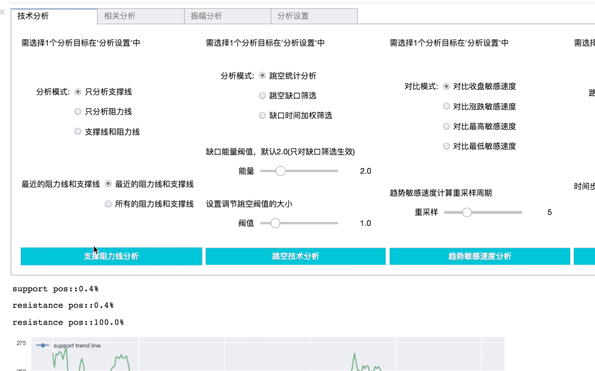
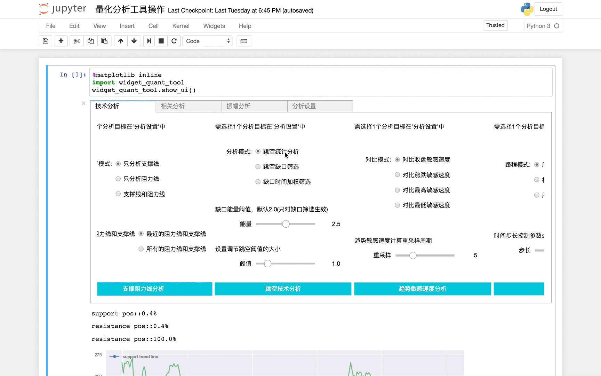
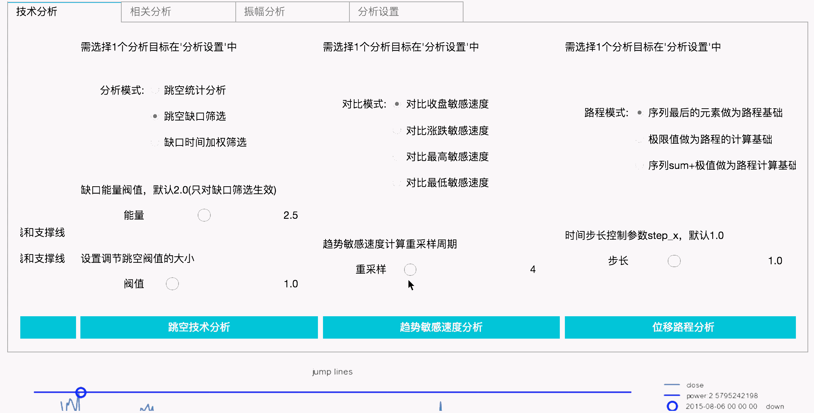
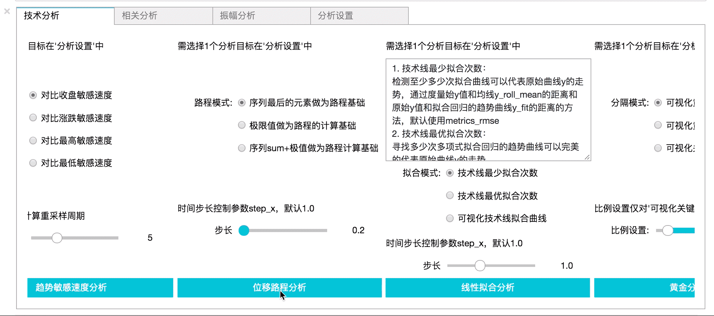
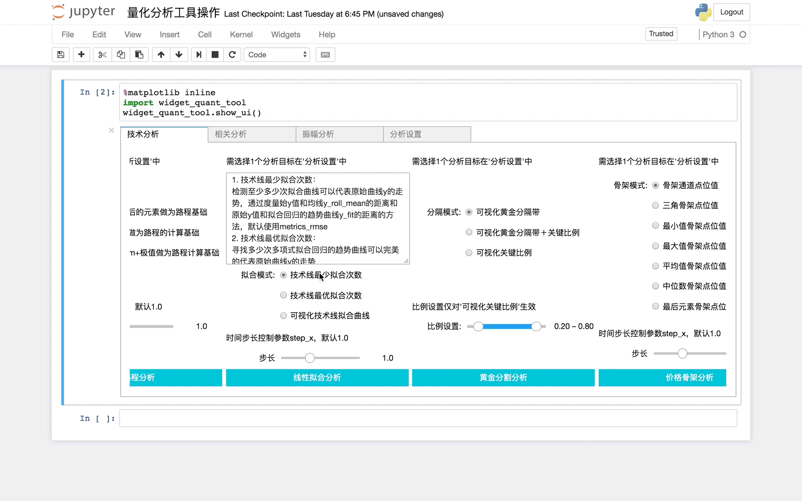
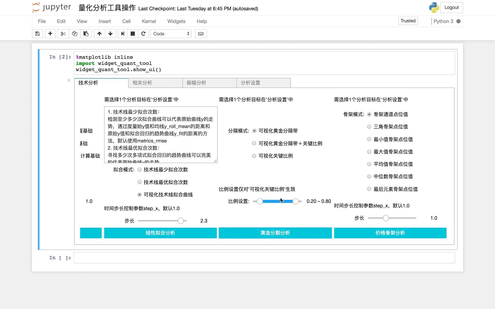
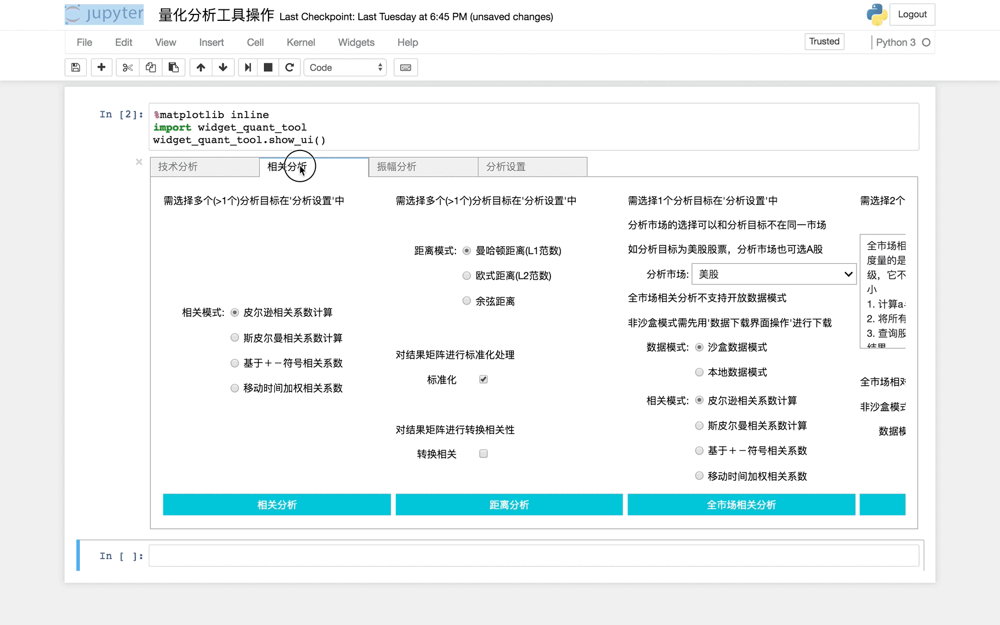
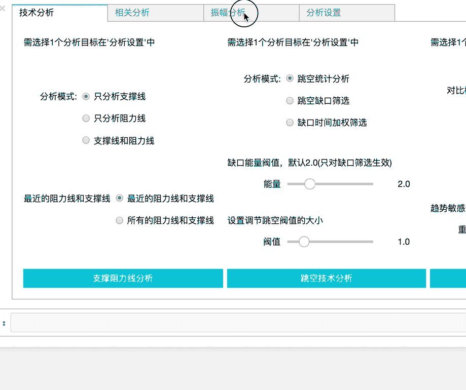
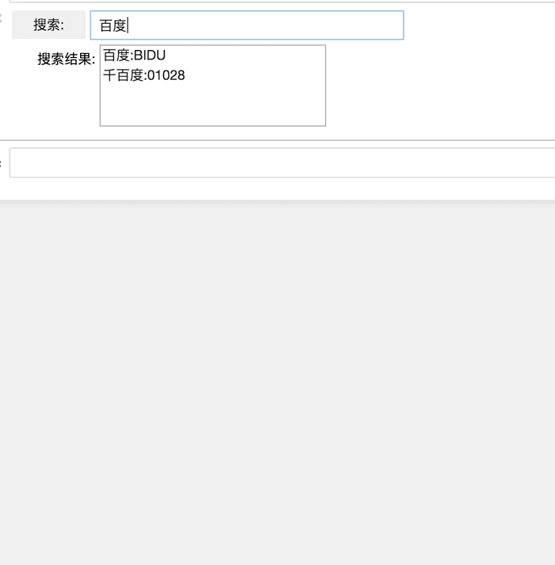

### 1. 历史回测界面操作

### 2. 阻力位支撑位分析操作

### 3. 跳空缺口分析筛选操作

### 4. 趋势敏感速度对比操作

### 5. 位移路程比分析操作

### 6. 线性拟合分析操作

### 7. 黄金分割分析操作

### 8. 价格通道分析操作

### 9. 相关性分析操作

### 10. 涨跌幅分析操作

### 11. 股票基本信息查询界面

更多abu量化教程请关注微信公众号: abu_quant

