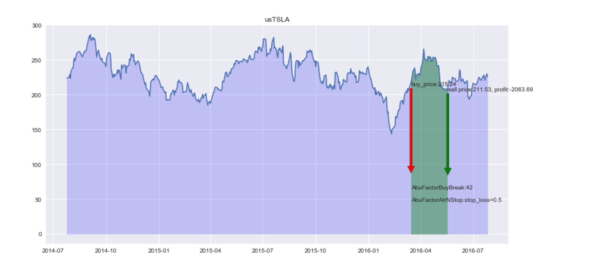

# ABU量化界面操作示例 

-----------------

## 第1节 择时策略的开发  & 第2节 择时策略的优化

[视频播放地址](https://v.qq.com/x/page/g0555b9k6ge.html)

[项目github地址](https://github.com/bbfamily/abu)

------------------------------------------

量化系统一般分为回测模块、实盘模块。

* 回测模块：首先交易者编写实现一个交易策略，它基于一段历史的交易数据，根据交易策略进行模拟买入卖出，策略中可以涉及买入规则、卖出规则、选股规则、仓位控制及滑点策略等等，回测的目的是验证交易策略是否可行。
* 实盘模块：将回测通过的策略应用于每天的实时交易数据，根据策略发出买入信号、卖出信号，进行实际的买入、卖出操作。

回测模块最重要的组成部份是择时、选股：

* 择时（什么时候投资）
* 选股（投资什么股票）

只有在对的时间买入对的股票才能获利，就像下面张小娴的名言一样，可以把‘股票’ 代替 ‘人’完全合乎逻辑。

>在对的时间，遇见对的人(股票)，是一种幸福 
>
>在对的时间，遇见错的人(股票)，是一种悲伤 
>
>在错的时间，遇见对的人(股票)，是一声叹息 
>
>在错的时间，遇见错的人(股票)，是一种无奈 

海龟交易法则是量化经典书籍中的经典作品，它里面介绍过一种趋势跟踪策略：N日趋势突破策略

趋势突破定义为当天收盘价格超过N天内的最高价或最低价，超过最高价格作为买入信号买入股票持有，超过最低价格作为卖出信号。

下面演示使用：

* 初始回测资金设置1000000
* 使用特斯拉(TSLA)做为买入选股目标
* 海龟向上突破42d做为买入策略
* 海龟向上突破60d做为买入策略

-----------------

### 1  基本止盈止损策略

量化交易系统一般都会有止盈策略和止损策略。

下面使用：

* 止盈止损策略
* 海龟向下突破120d

两个卖出因子策略并行同时生效做为示例

真实波幅atr作为最大止盈和最大止损的常数值:

* 当stop_loss_n 乘以 当日atr > 买入价格 － 当日收盘价格：止损卖出，如下止损n ＝ 0.5
* 当stop_win_n 乘以 当日atr < 当日收盘价格 －买入价格：止盈卖出，如下止盈n ＝ 3.0

### 2. 风险控制止损策略

效果比之前好多了，下面再加入一些其它卖出策略，量化交易系统中一般都会有风险控制策略，比如当股票今天价格开始剧烈下跌，采取果断平仓措施。

下面使用：

* 风险止损策略
* 止盈止损策略
* 海龟向下突破120d

三个卖出因子策略并行同时生效做为示例

风险止损策略中继续使用真实波幅atr作为常数值: 

当今日价格下跌幅度 > 当日atr 乘以 pre_atr_n（下跌止损倍数）卖出股票, 本例使用pre_atr_n＝1.0

### 3. 利润保护止盈策略

接下来注意下图这笔交易，会发现本来有很多盈利的，但是由于止盈没有达到，所以最后变成了亏损

可以通过添加保护盈利的卖出因子来使上图那笔交易获利

下面使用：

* 保护盈利策略
* 风险止损策略
* 止盈止损策略
* 海龟向下突破120d

4个卖出因子策略并行同时生效做为示例

atr移动止盈策略，当买入股票有一定收益后，如果股价下跌幅度超过close_atr_n乘以当日atr, 则保护止盈卖出，如下示例使用close_atr_n＝1.5

从交易结果可以看到最终那笔失败的交易也盈利卖出了。

注意：上面的很多拟合优化操作在实际应用中是不可取的，比如最后的那个使用AbuFactorCloseAtrNStop使交易盈利以及我之后即将讲解的另一些手段使整体交易变好的做法，不应该因为某些特定股票或者特定交易修改参数或者添加因子等方式使结果变好，这样就是过拟合择时交易系统，将会在下一章节来示例如何挑选参数及因子的选择问题，本节内容主要是为了讲解择时系统的示例。

更多关于abu量化系统请关注微信公众号: abu_quant

[abu项目开源地址](https://github.com/bbfamily/abu)   

[阿布量化网站地址](http://abuquant.com)

